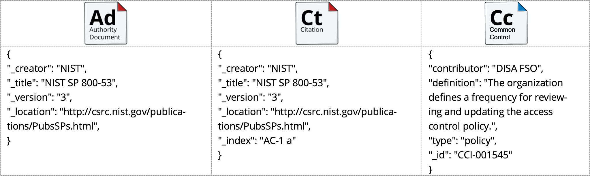
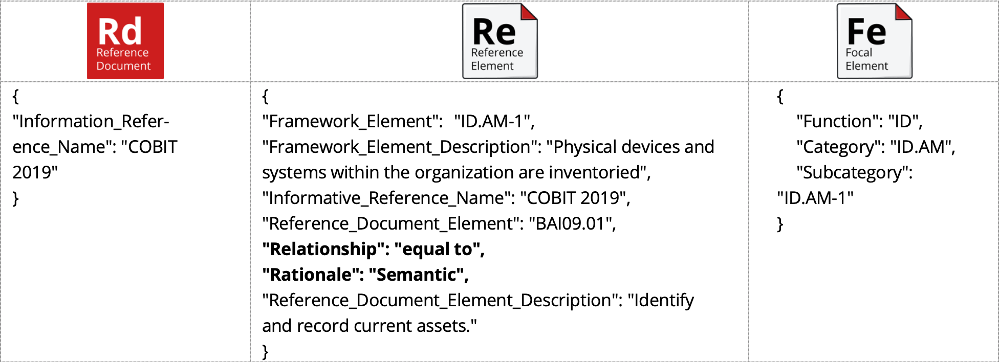
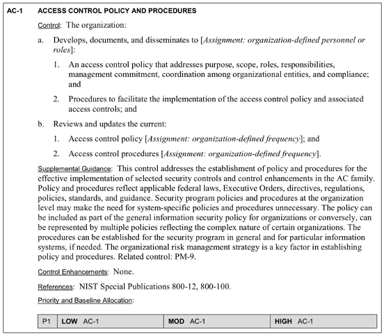
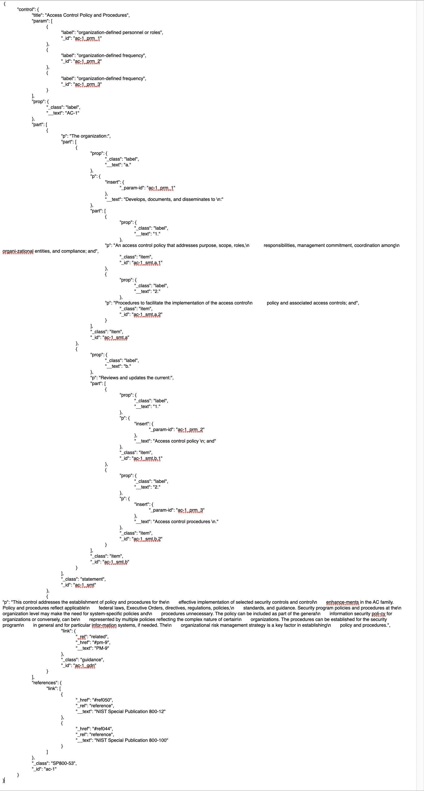
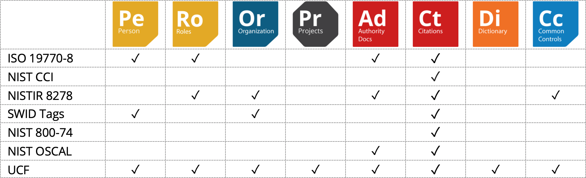

# Initial Schema analysis

Before we delve into describing the Federated Compliance Mapping model, let’s take a moment to understand three of NIST’s existing schemas – as the goal of the federated model is to be able to work with the existing schemas and _not replace them_. Therefore, the federated model must be interoperable with the existing schemas that are in play today.

## NIST CCI Schema

Although NIST’s Control Correlation Identifier (CCI) schema was originally written in XML, it has been easily translated into JSON through any number of methodologies, including simply pasting the XML into [https://codebeautify.org](https://codebeautify.org).

A CCI is a decomposition of an IA Control or an IA industry best practice into single, actionable statements. The CCI List is a collection of CCI Items, which express common IA practices or controls. A CCI Item is a foundational element of an IA policy or standard, written with a neutral position on an IA practice so as not to imply the specifics of the requirement. CCI bridges the gap between high-level policy expressions and low-level technical implementations. CCI allows a security requirement that is expressed in a high-level policy framework to be decomposed and explicitly associated with the low-level security setting(s) that must be assessed to determine compliance with the objectives of that specific security control. This ability to trace security requirements from their origin (e.g., regulations, IA frameworks) to their low-level implementation allows organizations to readily demonstrate compliance to multiple IA compliance frameworks. Therefore, the CCI will represent a single requirement that was decomposed from the source policy document. For example, if an IA Control for password policy were to include multiple requirements, addressing password minimum and maximum length, reuse, and minimum lifetime, five CCIs would originate from that single IA control. The five CCIs would address; a) minimum password length, b) maximum password length, c) password reuse, d) password minimum lifetime, and e) Establish admin procedures for lost/compromised passwords.

### Mini glossary

| **NIST Term** | **NIST Definition**                                                                   | **Our Term**       | **Definition**                                                    |
| ------------- | ------------------------------------------------------------------------------------- | ------------------ | ----------------------------------------------------------------- |
| id            | An individual CCI unique ID.                                                          | Common Control ID  | The unique ID of the Common Control.                              |
| definition    | An individual CCI mandate.                                                            | Common Control     | An individual Common Controls within the list of Common Controls. |
| title         | Any Authority Document being mapped into the CCIs.                                    | Authority Document | Any Authority Document mapped into the framework.                 |
| creator       | The authoring organization of the Authority Document.                                 | Author             | The authoring organization of the Authority Document.             |
| index         | An individual Citation’s Reference identifier from the referenced Authority Document. | Citation Reference | An individual Citation’s Reference identifier.                    |

### Data model and schema

While the schema doesn’t hold much more than the frameworks as spreadsheets, at least the schema is described in an object-oriented language so that computer systems can understand the output _natively_.

## NISTIR 8278’s initial schema

This is a great freshman effort by the NIST team into entering the modern world of compliance mapping and compliance frameworks. We completely support their efforts! And we _should_, seeing as how Network Frontiers, the parent company of Unified Compliance owns multiple patents in this area, including U.S. Patent No. 9,009,197; No. 8,661,059; No. 9,575,954; No. 9,977,775; and No. 10,606,945. Their JSON schema is broken down into three main areas:

1. Report Information containing the report date and a list of Reference Documents being mapped to the NIST Cybersecurity standard.
2. Information about the Citation within the NIST Cybersecurity standard being referenced, as well as a listing of the rationales and relationships for the match to the Reference Document Element.
3. An array of Reference Document Elements from the selected Reference Documents listed in (1) above, including their Reference Document Element (the document’s Citation Reference), the Description (the actual Citation Guidance), the item ID of the Cybersecurity standard it is matched to, and the rationale and relationship.

NISTIR 8278’s architecture draws a great deal from the UCF’s architecture, except that they’ve chanted the language somewhat.

### Mini glossary

| **NIST Term**                                 | **NIST Definition**                                                                | **Our Term**         | **Definition**                                                               |
| --------------------------------------------- | ---------------------------------------------------------------------------------- | -------------------- | ---------------------------------------------------------------------------- |
| Focal Document                                | The list of Citations from NIST’s Cybersecurity Framework.                         | Common Controls List | The list of all of the individual Common Controls mapped into the framework. |
| Focal Element / Framework Element             | An individual Citation’s Reference identifier from NIST’s Cybersecurity Framework. | Common Control ID    | The unique ID of the Common Control.                                         |
| Focal Element / Framework Element Description | An individual Citation within NIST’s Cybersecurity Framework.                      | Common Control       | An individual Common Controls within the list of Common Controls.            |
| Information Reference / Reference Document    | Any Authority Document being mapped into the OLIR program.                         | Authority Document   | Any Authority Document mapped into the framework.                            |
| Reference Document Element                    | An individual Citation’s Reference identifier from the Reference Document.         | Citation Reference   | An individual Citation’s Reference identifier.                               |
| Reference Document Element Description        | Any Citation within an Information Reference mapped against a Focal Element.       | Citation             | Any Citation within an Authority Document mapped against a Common Control.   |

### Data model and schema

The data model for NISTIR 8278 is a derivative of the UCF data model, as shown below with the extraction of the various JSON objects noted below each data model element.

The first thing you’ll notice is that there isn’t a representation of NIST’s Focal Document, the Cybersecurity standard. To us, that’s a major faux pax as you really can’t tell if the Focal Element is coming out of version 1.0, 1.1 and so on. A big “ooops” on their part.

Notice, also, in the middle column that we bolded _how_ the Reference Element is connected to the Focal Element – through one of three means; _syntactic, semantic,_ or _functional_ equivalencies. This is important as this is the first schema outside of the UCF to add _how_ the Citation is related to the Compliance Framework’s control. It is a justification well needed as part of the proof that the mapping work has been done.

As we said above, it’s a good freshman effort and we support them all the way.

## NIST’s OSCAL Catalog model

NIST has developed the Open Security Controls Assessment Language (OSCAL) as a standardized, data-centric framework that can be applied to an information system for documenting and assessing its security controls. As such, OSCAL isn’t a model, schema, or methodology for an overall compliance framework, as it focuses primarily on dissecting individual Authority Documents and their Citations. The standardized formats provided by the OSCAL project help to streamline and standardize the processes of documenting, implementing and assessing security controls. The automation enabled by the OSCAL formats will reduce complexity, decrease implementation costs, and enable the simultaneous, continuous assessment of a system’s security against multiple sets of requirements. In short, OSCAL takes the text of the image below…

...and turns it into the following JSON structure (this is rather long, sorry):

As you can see, there’s a _lot_ to their catalog model. So much so that this isn’t the place to start delving into their schema. We’ll do _that_ as we start marrying all of the schemas together into a federated model.

## Schema recap

Below is the Federated Compliance Mapping model and where we will be drawing our sources from:

