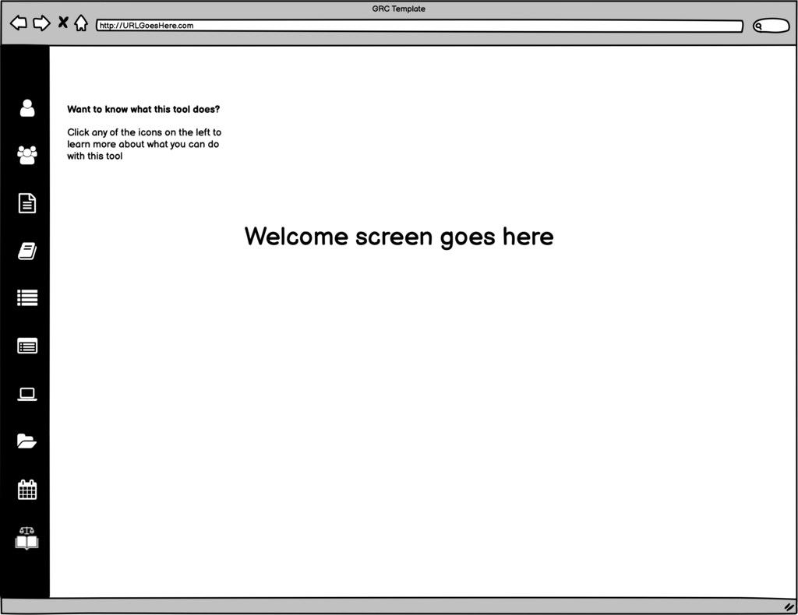

# Authority Document Library

The Federated Authority Document Library is a collaborative, community system that has established, and maintains, the _world’s largest_ library of Authority Documents that organizations have identified they need to comply with.

Being a collaborative effort, this library can be found in multiple locations, a partial list is below:

* Claris Marketplace has an add-on for Filemaker databases that allows you to search the Authority Document library and then save your own list. It can be found [HERE](https://marketplace.claris.com/detail/0000.html). It is free.
* [CommonControlsHub.com](https://cch.commoncontrolshub.com/) has both free and paid versions of the Authority Document library that allow you to search it and create _multiple_ lists. Both versions allow you to fully search the library. The free version allows you to select up to 5 Authority Documents per list and have up to 3 lists. The paid version allows up to 50 Authority Documents per list with unlimited lists. In addition, paid accounts can turn their lists \(with associated Citations and Common Controls\) into a Portable Compliance Profile®.
* Unified Compliance Framework has a _search only_ capability for free. It can be found [HERE](https://www.unifiedcompliance.com/products/search-authority-documents/).

The Authority Document Library utilizes four schemas:

* [AuthorityDocument](https://grcschema.org/AuthorityDocument) – defines the documents themselves;
* [Organization](https://grcschema.org/Organization) – defines which organization created the Authority Document \(if no author list is present\), which organizations publish them, and which teams have mapped them;
* [Person](https://grcschema.org/Person) – defines the authors, editors, and mapping team members;
* [Role](https://grcschema.org/Role) – defines the role each of the people have played in the creation, editing, or mapping of each Authority Document.

The Authority Document Library is searchable three ways:

1. Open searching of names, versions, and common names.
2. Traversing the geographical hierarchy.
3. Traversing the subject matter hierarchy.

## Functionality of the search window

Below is a mockup of the Federated Authority Document library. We provide this mockup instead of actual in-use products because each product can be designed slightly different as, again, this is a collaborative effort based on _suggested_ layouts.

1. Probably the easiest way to find an Authority Document is to type the name and version number into the search field – even a partial name or version number brings up results. You don’t have to worry about getting the name absolutely correct either. Searching for NIST CSF will bring up the correct document, even though that’s not it’s official name.
2. Or, you can get a list of Authority Documents by their Geography by clicking the Geography button or Subject Matter by clicking _that_ button.

A more advanced method to search would be to click Subject Matter and then click a checkbox for a Subject Matter area of compliance. The Impact Zones and related Common Controls populate on the right side of the page. Then click Geography, and you will be able to see the coverage the UCF has in those displayed countries. Additionally, you can unselect any countries that aren’t relevant to your organization.

Alternatively, you could reverse that process and start by clicking Geography and click the checkboxes of the countries your organization must comply with. The Impact Zones with Common Controls will populate on the right side of the page. Then click Subject Matter, and you can disable or uncheck categories or areas of compliance that aren’t relevant to your company.

1. Disclosure triangles are used to the point wherein an Authority Document is shown. The Authority Document will have a document icon in front of the name, and the name that will be displayed is the Official Name.
2. An \(i\) button will be immediately to the right of the Authority Document name. Clicking this button will display the Authority Document’s Title report \(shown later\).
3. A checkbox will be placed to the right of the \(i\) button. Checking this box will add the Authority Document to the Selected List in the right pane.
4. Clicking Remove will bring up a dialog asking the end user if they wish to remove the Authority Document from the selected list. Clicking Yes will remove it from the list.

Initially, the SAVE LIST button will be disabled. It will only be enabled once an Authority Document has been added to the list. This functionality has not yet been determined.

7. Initially, the SAVE LIST button will be disabled. It will only be enabled once an Authority Document has been added to the list. This functionality has not yet been determined.

## Initial Load of the search window

Because the library can be searched three ways, the initial load will need to start with a default, as shown below.

1. By default, the opening screen should show the GEOGRAPHY hierarchy on the left, with all disclosure triangles closed. The GEOGRAPHY button should be highlighted.
2. The SAVE LIST button should be disabled until documents have been selected.
3. The SUBJECT MATTER button will be enabled, but not highlighted.

## Displaying the initial geography and subject matter lists

The API calls to display the subject matter list or geography list are as follows:

* Geography – [https://short.grcschema.org/ADHierarchy](https://short.grcschema.org/ADHierarchy)
* Subject Matter - [https://short.grcschema.org/ADSubjectMatters](https://short.grcschema.org/ADSubjectMatters)

Both of these API calls return the complete list of all Authority Documents in their respective hierarchies. The schemas can be found here: 

* Geography – [https://grcschema.org/ADHierarchyStub](https://grcschema.org/ADHierarchyStub)
* Subject Matter - [https://grcschema.org/ADSubjectMatterStub](https://grcschema.org/ADSubjectMatterStub)

### Showing documents in the hierarchy

This wireframe describes the design specification for searching the federated mapping Authority Document list’s hierarchical display.

1. As the hierarchy is disclosed, the leaf nodes, Authority Documents, will display a document icon instead of a disclosure triangle. When displaying the Authority Document, also display an information icon \(i\) and a selector checkbox.
2. When the user clicks the information icon \(i\), display the Authority Document Reference Card as a modal window.
3. When the user clicks the selector checkbox, add that Authority Document to the Selected List.

## Traversing the hierarchies

This wireframe describes the design specification for displaying hierarchies in the federated mapping Authority Document list.

1. Any document that has been selected will be listed in the selected list.

That document will also be displayed in the hierarchical list on the left.

1. Switching between geography and subject matter, any document in the selected list will then be displayed, in the correct hierarchical position, in the hierarchical left window.

In other words, if the King Committee document were selected in Geography, when switching to Subject Matter that document would automatically be displayed in the Subject Matter list according to its subject matter.

Switching back again would display it in its geographical hierarchical position.

## Displaying more information \(i\) about the Authority Document

This wireframe describes the design specification for displaying the federated individual record information for Authority Documents in the Authority Document list.

This is to be designed and displayed as a modal dialog.

The API call for this is found at [https://short.grcschema.org/AuthorityDocument](https://short.grcschema.org/AuthorityDocument). When calling this API call, the Authority Document’s ID needs to be referenced.

1. This is core information from https://grcschema.org/AuthorityDocument
2. This is an array of simplified names found in https://grcschema.org/CommonNames
3. This is an array that can be found in https://grcschema.org/Authors
4. This is an array that can be found in https://grcschema.org/Editors
5. This information is specific to each publication location of the document in question. This can be found at https://grcschema.org/ADIdentifiers
6. This information is specific to each mapping version of the document in question. This can be found at https://grcschema.org/ADMapping.

