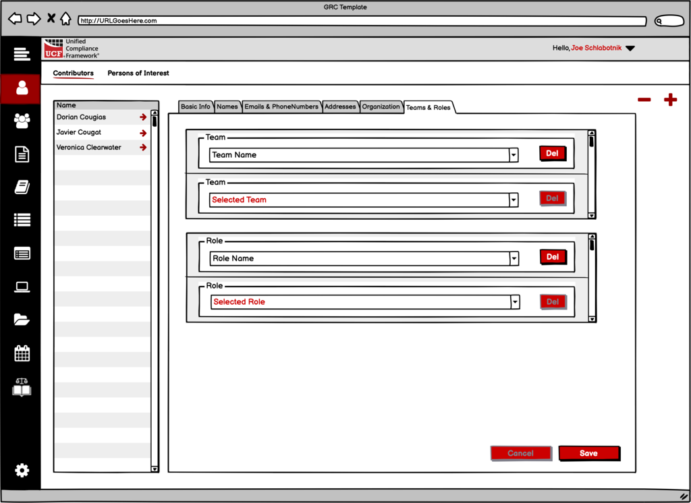

# Initial Sign-up sequence

All wireframes for this portion of the Compliance as Code project are available at:

[https://balsamiq.cloud/srj76i4/p32oqgh](https://balsamiq.cloud/srj76i4/p32oqgh)

The scope of this portion of the project is to allow an unknown individual sign up to use the Compliance as Code multi-tenant application.

The layouts expressed in this documentation are for _communication purposes only_. They are not meant to provide branding guidance or even an official look-and-feel. They exist merely to convey the technical aspects of the project. _Real_ designers will create something much more effective.

## Schema

The schema for an account is found in multiple locations:

* [http://grcschema.org/Account](http://grcschema.org/Account), which provides the core schema for an account;
* [http://grcschema.org/Person](http://grcschema.org/Person), which provides the schema for a person’s name and email address \(becoming the User in the account array\); and
* [http://grcschema.org/Organization](http://grcschema.org/Organization), which provides the schema for the domain to organization match; with
* an addition of having to track the Rapid API key, which isn’t in a schema as that data should be hidden from normal view. The schema is divided into necessary data and optional data.

The ERD for an account looks like this:

### Necessary data

The necessary data for this portion of the project is as follows:

Rapid API key

Administrator’s contact information \(name, address, email\)

Organizational domain & name

Account name

### Optional data

The optional data for this portion of the project is as follows:

Billing contact information \(name, address, email\)

Shipping information \(address\)

## Sign-up Page 1

The initial sign-up has two options and will double as a sign-in method for the administrator;

1. Sign-up using the Federated Mapping User store, and
2. Sign-up using an auth0 User store.

In either case, these are the key data elements that need to be captured:

1. The administrator’s first and last name.
2. The administrator’s corporate email address.
3. _If_ using the Federated Mapping User store, the desired password. OR we need them to use an auth0 authentication process.

Whether using the Federated Mapping User store or an auth0 User store, the sign-up/sign in information must also be transferred into the Account information. We’ll cover that under the section about **signup sequence** below.

## Sign-up Page 2

We’ve separated the account’s Rapid API Key from the signup/sign in information in our diagrams. At this point we ask the user to enter their Rapid API key and we give them the URL for obtaining one if they don’t have it. **The signup process cannot continue without a valid key** \(which means you might want to write a short test of any kind to ensure valid data comes back\).

## Sign-up Page 3a&b

Once we have the administrator’s personal information, we need to get information about the account’s official organization. On this page one of two things will happen:

1. a matching domain will be found \(derived from the user’s corporate email address\) and therefore an existing organization name and ID will be returned, or
2. nothing will be found and the user will need to create a new organization.

 

An organization was found \(left\) or not found and needs to be created \(right\)

## Sign-up Sequence

The sign-up sequence for a new account is a bit involved. The reason for this is that records of _any kind_ being added to the federated database are audited and require a _live_ userid for a POST or PATCH. Add to that, organizational domains are _unique_ in the system – they can be added, and attributed to only _one_ organization. Therefore, once an organization is added, every user with the same email domain will be added _to that organization_. Likewise, every federated Group and Initiative will be added to that organization. And in that light, each account \(even though it will be local to the host creating it\) is also added to that organization. Here is the sequence of events for registering a new account \(and thus, a new administrator\).

1. The user adds the administrator’s name information to the local system.

2. The user adds the corporate email address to the local system.

3. The local system then creates the domain name from everything to the right of the “@” symbol in the email address.

4. Prior to the Sign-up page wherein the user is asked for an account name, the local system queries the federated database using the GET Organization List api call with the query of domain=domain from the record. A sample is below:

`{  
 "headers" :  
 {  
 "useQueryString" : true,  
 "x-rapidapi-host" : "grcschema.p.rapidapi.com",  
 "x-rapidapi-key" : "myapikey"  
 },  
 "method" : "GET",  
 "query" :  
 {  
 "domain" : "snortblat.com"  
 },  
"url" : "https://grcschema.p.rapidapi.com/Organization"  
}`

5. **If nothing is found** the federated database will return “\[ \]”.

6. **If nothing is found** the user is then asked to create an organization name.

7. **If a domain is found** the federated database will return @set\[0\]id:organizationid and @set\[0\]name:organizationname.

8. **If a domain is found** the local system will then update the organization fields appropriately and inform the user that an organization was found and will be used.

9. The user now adds an account name to the local system.

10. _Before the organization can be added \(if necessary\)_ a POST User0 api call must be made to the federated database. This is like a normal POST Person call, but with the header changed to x-requester-person:0 instead of the normal Person id \(which doesn’t exist yet for this administrator\).

11. The federated database will return the same information that was sent, but with the new **id** for the record.

12. The local system then needs to update the Person id field for the administrator’s record.

13. **If no domain was found** the local system then creates a POST Organization api call to the federated database.

14. **If no domain was found** the federated database then returns the Organization record with the correct name and id.

15. **If no domain was found** the local system then updates the Organization id with the correct information.

16. The organization id is then added to the organization\_fk in the Person table.

17. The organization id is then added to the organization\_fk field in the Account table.

### When finished

Several key pieces of information need to be present: 

1. the domain for the organization \(derived from the administrator’s email address\);
2. the name of the organization, and the name of the account \(both can be the same\);
3. the administrator’s contact information; and
4. the Rapid API key.

