# Managing Accounts

All wireframes for this portion of the Compliance as Code project are available at:

[https://balsamiq.cloud/srj76i4/ple67oc](https://balsamiq.cloud/srj76i4/ple67oc)

The scope of this portion of the project is to allow _the administrator_ of a known account and to fill out additional information about the account assigned to the Organization.

The layouts expressed in this documentation are for _communication purposes only_. They are not meant to provide branding guidance or even an official look-and-feel. They exist merely to convey the technical aspects of the project. _Real_ designers will create something much more effective.

## Schema

The schema for an account is found in multiple locations:

* [http://grcschema.org/Account](http://grcschema.org/Account), which provides the core schema for an account; and
* [http://grcschema.org/Organization](http://grcschema.org/Organization), which provides the schema for the domain to organization match.

The ERD for working with an account looks like the diagram that follows:

### What needs to be understood about this structure

Organizations exist outside of Accounts. When you think of an organization, think of, say, IBM. It exists whether IBM has an account within this system or not.

Then, when someone that has _ibm.com_ in their email address wishes to establish an Account in the system, they can do so, and it is tied to the IBM Organization. And then another person with _ibm.com_ in their email address might want to establish a _different_ account – they can do so – and _that account, too_, will be linked to the IBM Organization. Both accounts are tied to the IBM Organization through the domain in their email addresses.

Each Account can have its own, private, Groups and Initiatives. As well as its own addresses and phone numbers, not directly associated with the formal addresses associated with the Organization.

## Navigation

Navigation to the Account is accessed through the **Account Settings** icon at the bottom of the navigation pane. When the pane is open, it is named **Account Settings** as shown below.

Within the Account section of the shell, sub-navigation must include capabilities to switch between _this_ account, _the account’s organization_, other subnavigation items associated with the account.

## Basic Info

Basic information for the account isn’t much. Just the account name \(which should already exist\), the meta data \(which also should exist\), and the optional description and telephone numbers.

### Adding and deleting telephone numbers

Adding a new telephone number brings up a modal dialog prompting the user to enter the telephone number.

Deleting a telephone number brings up a dialog to ensure that the deletion request wasn’t a mistake.

## Postal Addresses

There are three addresses \(with at least the primary being required\); primary billing, and shipping.

When filled out, they must be filled out in the order of _country_, _state_, _city_, and then the rest of the information. This is because _country_, _state_, and _city_ are all pop-ups, one deriving its list from the other.

1. **Country** **API** – [https://short.grcschema.org/API-Country List](https://short.grcschema.org/API-Country%20List)

2. **State API** - [https://short.grcschema.org/API-State List](https://short.grcschema.org/API-State%20List3)

[3](https://short.grcschema.org/API-State%20List3). **City API** - [https://short.grcschema.org/API-City List](https://short.grcschema.org/API-City%20List)

## Members

This is a listing of members. Members are added/managed through the Account Users layout. Members can be navigated to by clicking on arrow by their name.

## Account Groups

Each account can have multiple groups within the account, for various purposes. There are three screens that can be accessed for each group.

### Account Group Basic Info

1. Groups can be navigated to by their name in the Groups navigation pane.
2. This is the group’s name, and is mandatory.
3. An optional description of the group can be added here.
4. A parent group can be selected _from existing account-related groups_. Any child of _this_ _group_ will be listed in the sub groups list.
5. This is optional. However, when filled out, the address must be filled out in the order of _country_, _state_, _city_, and then the rest of the information. This is because _country_, _state_, and _city_ are all pop-ups, one deriving its list from the other.
6. An optional telephone number for the group can be added.

### Account Group Character

An account group’s character helps determine how to interact with the group when trying to achieve a goal. This can be very useful.

1. **Group Character settings** – these are options settings wherein the user selects a number from 1 to 10 for each of the four characterizations. Selections from 1-5 will create a _formal_ setting and 6-10 will create an _informal_ setting. There are images associated with each of the formal and informal settings for each of the four characterizations.

2. **Organizational Character Index** – this is an optional field to be filled out for the _the account_. If it was filled out at the account level, that information will show up here. The button for the survey should link to:

[https://developer.unifiedcompliance.com/orgcharindex.html](https://developer.unifiedcompliance.com/orgcharindex.html)

### Account Group Members

This is a listing of members. Members are added/managed through the Account Users layout. Members can be navigated to by clicking on arrow by their name.

### Account Initiative Basic Info

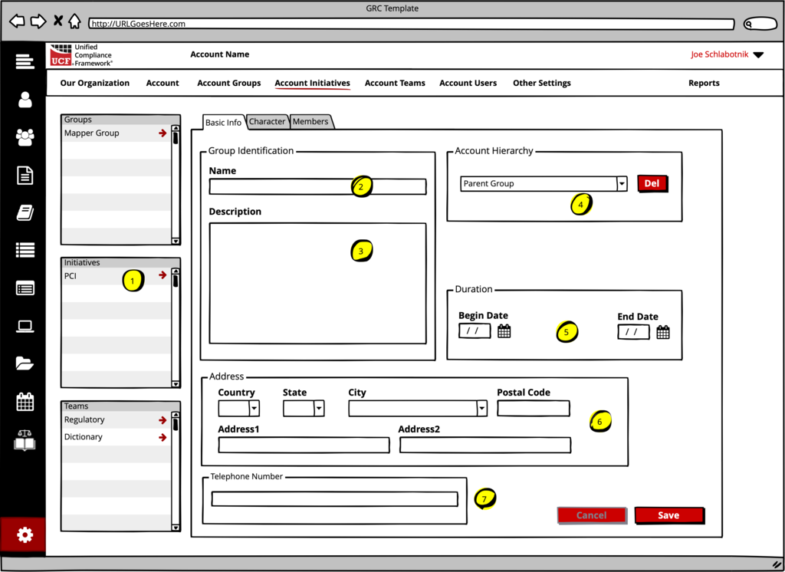

1. Initiatives can be navigated to by their name in the Initiatives navigation pane.
2. This is the Initiative’s name, and is mandatory.
3. An optional description of the Initiative can be added here.
4. A parent group can be selected _from existing account-related groups_. Unlike Account Groups, Account Initiatives cannot have children.
5. Duration is unique to Initiatives. Initiatives often have a begin and end date.
6. This is optional. However, when filled out, the address must be filled out in the order of _country_, _state_, _city_, and then the rest of the information. This is because _country_, _state_, and _city_ are all pop-ups, one deriving its list from the other.
7. An optional telephone number for the group can be added.

### Account Initiative Character

An account group’s character helps determine how to interact with the group when trying to achieve a goal. This can be very useful.

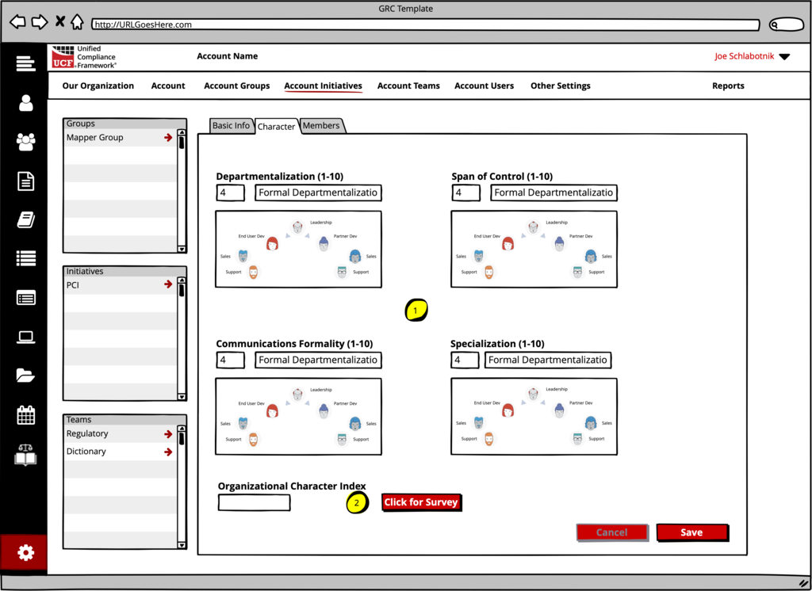

1. **Group Character settings** – these are options settings wherein the user selects a number from 1 to 10 for each of the four characterizations. Selections from 1-5 will create a _formal_ setting and 6-10 will create an _informal_ setting. There are images associated with each of the formal and informal settings for each of the four characterizations.

2. **Organizational Character Index** – this is an optional field to be filled out for the _the account_. If it was filled out at the account level, that information will show up here. The button for the survey should link to:

[https://developer.unifiedcompliance.com/orgcharindex.html](https://developer.unifiedcompliance.com/orgcharindex.html)

### Account Initiative Members

This is a listing of members. Members are added/managed through the Account Users layout. Members can be navigated to by clicking on arrow by their name.

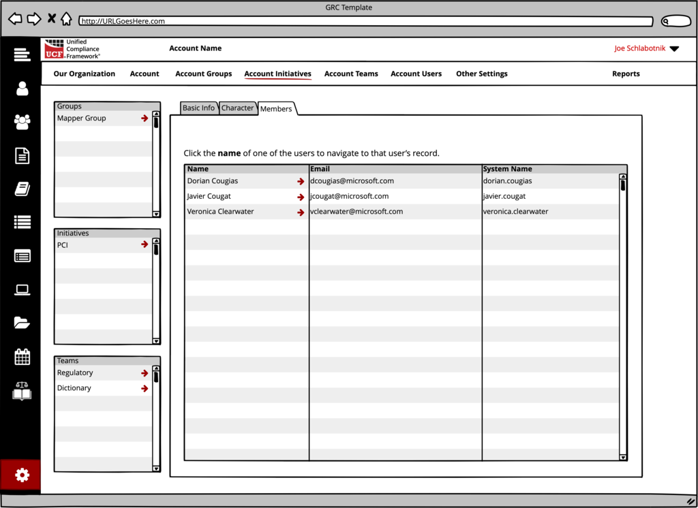

## Account Teams

Teams is a very simplistic screen. A team doesn’t need much information, other than the team lead’s designation and the team members.

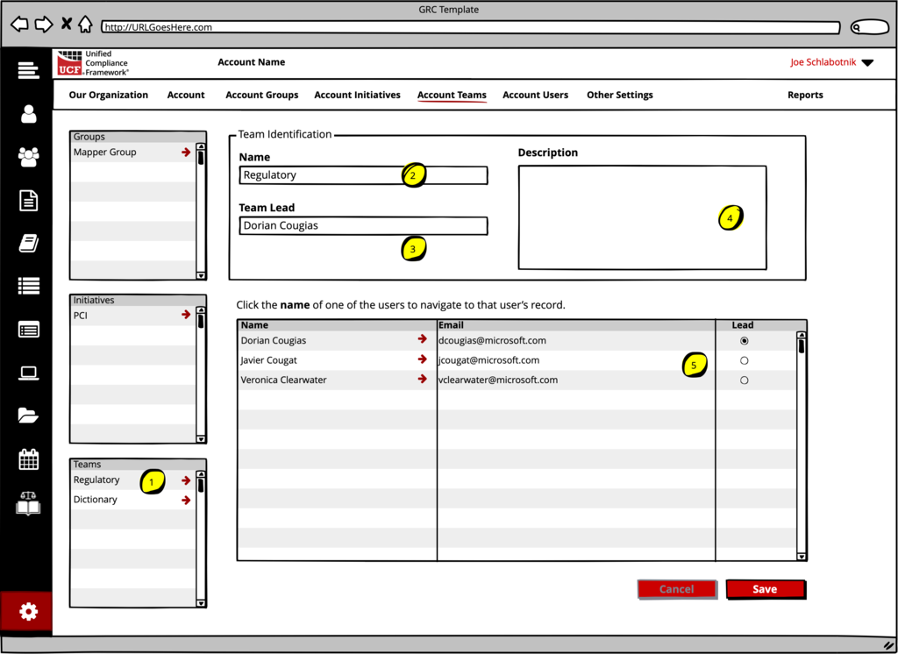

1. Teams can be navigated to by their name in the Initiatives navigation pane.
2. The name of the team is entered here.
3. The team lead appears in this field. It is _not_ modifiable here, as this is a selection that can be made in the user’s table.
4. The description for the team is optional.
5. The members of the team are listed and can be navigated to via clicking the arrow by their names.

## Account Users

This section covers all of the information associated with each user within the account. The schema for an account is found in multiple locations:

* [http://grcschema.org/Account](http://grcschema.org/Account), which provides the core schema for an account;
* [http://grcschema.org/Person](http://grcschema.org/Person), which provides the schema for a person’s name and email address \(becoming the User in the account array\); and
* [http://grcschema.org/Organization](http://grcschema.org/Organization), which provides the schema for the domain to organization match; and
* [http://grcschema.org/Users](http://grcschema.org/Users), which provides a simplified schema for connecting users to accounts.

The ERD for working with staff looks like the diagram that follows:

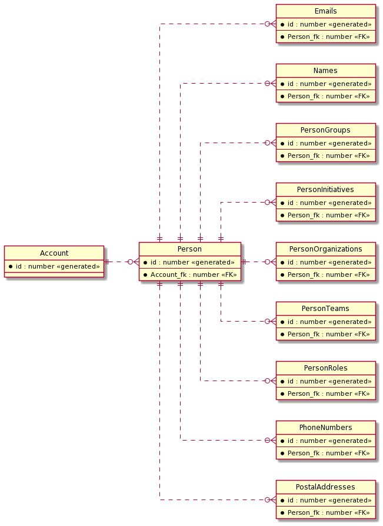

### Basic Info

Basic information for each staff member comprises their primary name & email address \(mandatory\), and optional social addresses. The suggested layout for basic information follows:

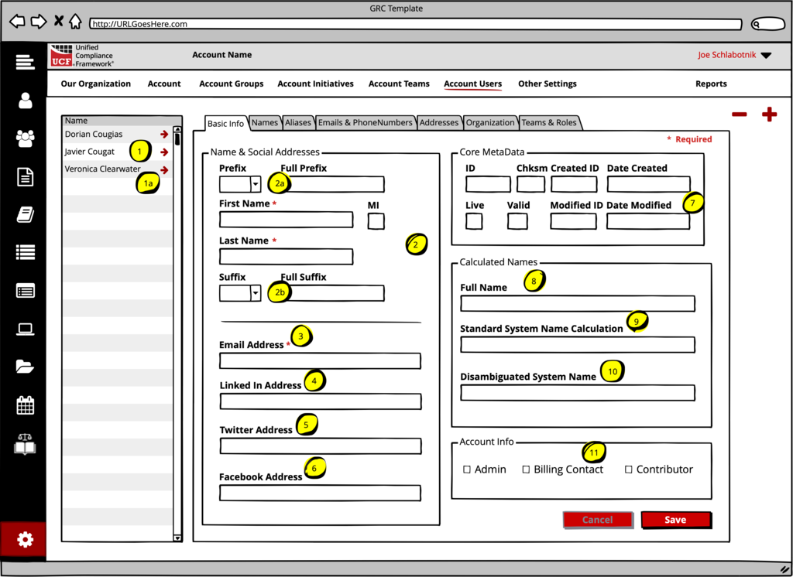

1. Navigation must be available for all staff members. In this example we’ve doubled navigation with the ability to add new staff members \(by entering them into the last blank field\) or deleting them through the minus “-“ button.

2. Each person’s name has two mandatory fields: first name and last name. This sets the person’s primary name content in the Names layout.

2a. The Prefix for a person’s name is created from a pop-up selector. The results of the selection should show both the abbreviated prefix and the full prefix. \(see Name prefixes and suffixes below\)

2b. The Suffix for a person’s name is created from a pop-up selector. The results of the selection should show both the abbreviated suffix and the full suffix. \(see Name prefixes and suffixes below\)

3. It is **mandatory** that the domain for the staff member’s email address be derived from the domain of the organization. Therefore, this field can either be manually filled out \(but tested against the domain\) or it can be automatically filled out from the _disambiguated system name_ \(10\) plus the domain name.

4-6. Social media addresses are optional.

7. This is automated data and comes from the records. Having this in the Staff layout _is optional_.

8. This is automated. \(see Calculating the full name below\).

9 & 10. These are both automatically calculated. \(see Calculating disambiguated names below\).

11. These are optional checkboxes that denote whether the staff member is the **admin**, the **billing contact**, or a **contributor** to content added to the federated mapping system.

#### Name prefixes and suffixes

For standardization purposes all name prefixes and suffixes are added via a predefined list, using the ID of the prefix and suffix to tie the text to the ID. The application _must_ maintain tables of these references and _must_ update those tables on a regular basis to ensure parity with the federated system.

* * **Name Prefix** **schema** – [http://grcschema.org/NamePrefixes](http://grcschema.org/NamePrefixes)
  * **Name Prefix API** – [https://short.grcschema.org/API-NamePrefix List](https://short.grcschema.org/API-NamePrefix%20List)
  * **Name Suffix schema** – [http://grcschema.org/NameSuffixes](http://grcschema.org/NameSuffixes)
  * **Name Suffix API** – [https://short.grcschema.org/API-NameSuffix List](https://short.grcschema.org/API-NameSuffix%20List)

#### Calculating the full name

The full name is calculated as

if\(prefix≠null;prefix & “ “\) & first name & “ “ & if\(middle initial≠null;middle initial & “ “\) & last name & if\(suffix≠null;” “ & suffix\)

#### Calculating disambiguated names

See other settings, below.

### Staff Names

Staff names is an array of names. The person’s _primary_ name can be set from here or on the Basic Info layout.

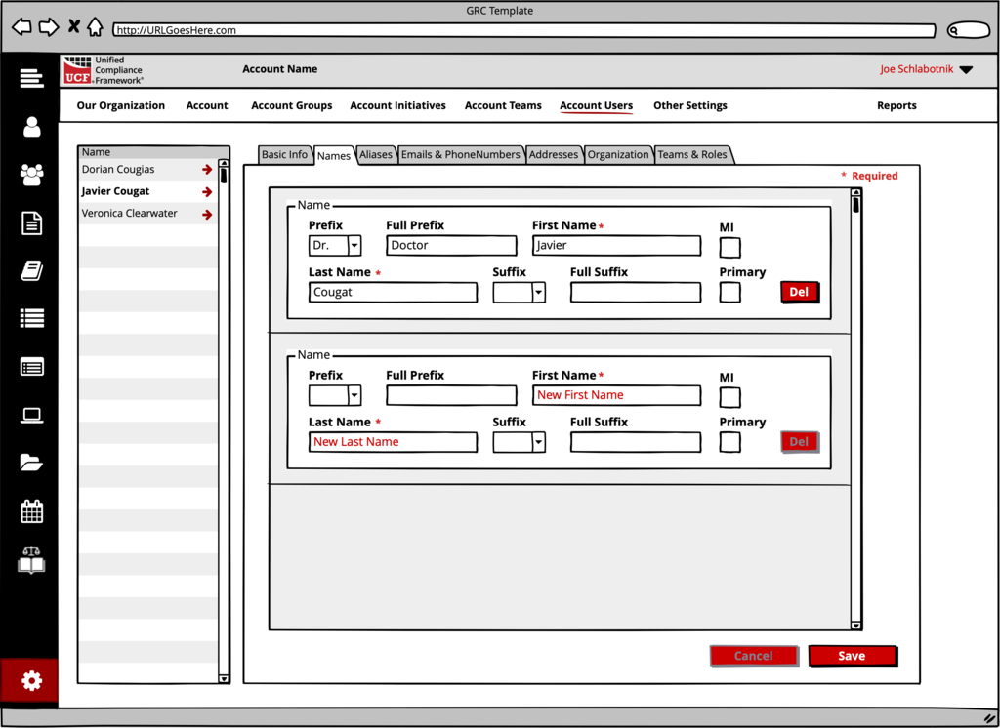

For all names, the First Name and the Last Name must be filled out.

There is a bit of a trick to this layout – a person’s name can either be in the format of a name or an alias. If an alias, the only thing filled out is the freeform\_name field, not shown here. Therefore, this layout should _not include_ any record wherein the freeform\_name is the only entry.

### Aliases

There is a bit of a trick to this layout, as mentioned in Staff Names above. This layout is _only_ for names records that _only_ have the freeform\_name field filled out.

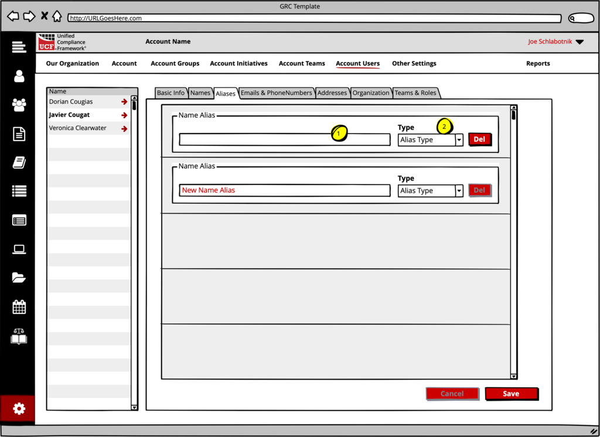

1. This is the freeform name. The **Disambiguated System Name** is _always_ entered as a record for this user.

2. This is the _alias type ID_ and is derived from _something other than_ “1”, from the Primary field.

 2 = disambiguated system name

 3 = previous system name

### Emails and Phone Numbers

These are both arrays assigned to a staff member. Other than the primary email address, they are optional.

Emails & Phone Numbers

The _calling codes_ for phone numbers can be automatically created using the callingcodes schema and API calls.

* * **Calling Codes Schema** - http://grcschema.org/CallingCode
  * **Calling Codes API** – not finished yet

### Postal Addresses

Postal Addresses for each staff member are optional. When filled out, they must be filled out in the order of _country_, _state_, _city_, and then the rest of the information. This is because _country_, _state_, and _city_ are all pop-ups, one deriving its list from the other.

Postal Address

1. **Country** **API** – [https://short.grcschema.org/API-Country List](https://short.grcschema.org/API-Country%20List)

2. **State API** -

[https://short.grcschema.org/API-State List](https://short.grcschema.org/API-State%20List3)

[3](https://short.grcschema.org/API-State%20List3). **City API** - [https://short.grcschema.org/API-City List](https://short.grcschema.org/API-City%20List)

### Organization

This is where the users can be added to existing Groups and Initiatives.

Staff Organization, Group, and Initiatives

1. Groups should be pop-ups selectable from _existing_ groups _found in this account_.

2. Initiatives should be pop-ups selectable from _existing_ initiatives _found in this account_.

### Teams and Roles

These are completely optional for being filled out. Both teams and roles should be pop-ups selectable from _existing_ teams and roles _found in this account or Organization_.

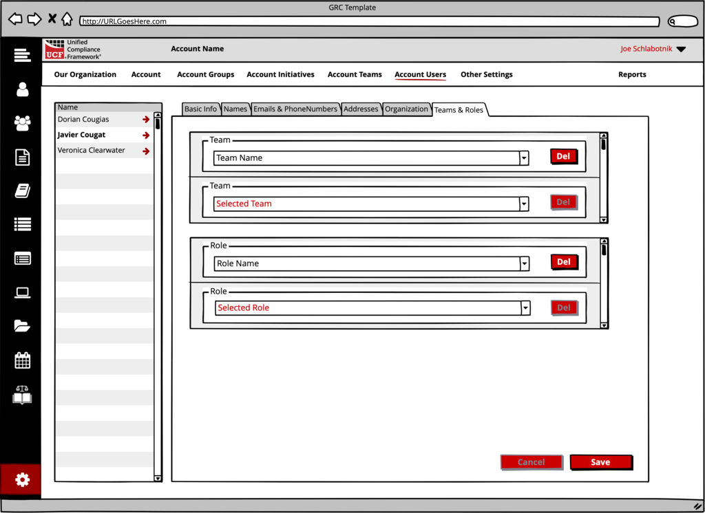

## Other Settings

Other settings is where the account’s API keys, branding, and other information is stored.

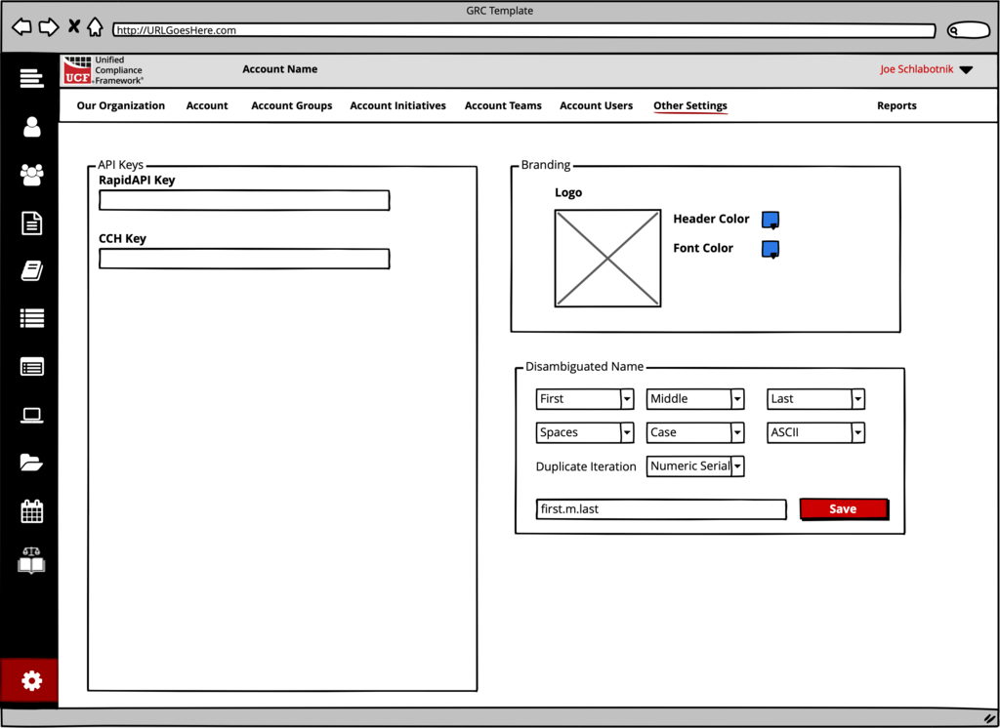

### Disambiguated Name

The larger the organization, the greater the chances that duplicate names might exist when combining first and last names. Two people named James and John Smith would create a duplicate if the organization’s naming standard were first initial followed by last name. Joseph L. Smith and Joe T Smith would create duplicates if the organization’s naming standard were first name followed by last name.

Therefore, two things must happen.

a. The organization should establish a standard name configuration system for creating system names. The basic system can be as simple as the “name configurator” shown below:

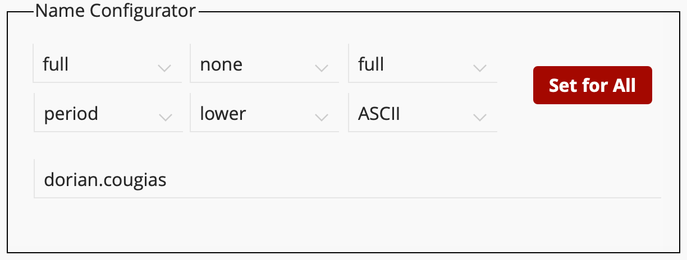

This has settings for first, middle, last names, whether to uses spaces or periods between names, how to set the case, and even whether to convert the text to ASCII characters.

b. The name configuration standard _could_ produce duplicate results. Therefore, a methodology for disambiguation needs to be put into place. Whether this method is configurable \(such as the name configurator\) or automatic doesn’t matter. One algorithm is to simply add a numeric value behind the system name so that the second joseph.smith would become joseph.smith2, the third joseph.smith3, and so on. It can be more complicated than that, or as simple as that.

## Our Organization

When clicking on **Our Organization**, the end user is taken to the **Organizations** section and the end user’s organization is selected.

