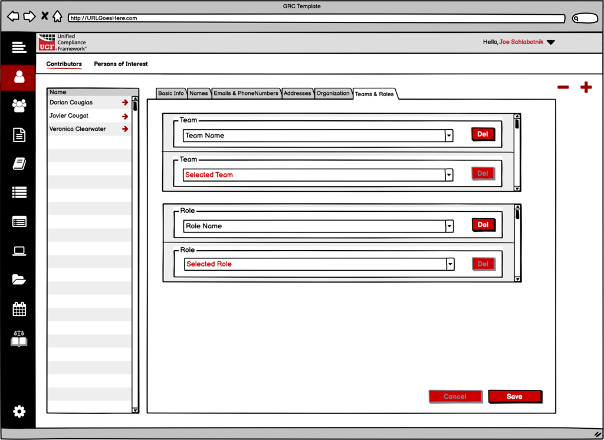

# Managing Persons

Users within the Federated Mapping system are those individuals who are

* a contributor (author, editor, etc.) to any form of authority document;
* a mapper, editor, reviewer, lexicographer on a mapping team;
* a named individual within an Authority Document.

Users within the ecosphere of Governance, Risk, and Compliance, are include

* document contributors (such as policy, standard, procedure, etc. authors, editors, and so on);
* document signatories or assignees;
* anyone named within a system;
* and any other time a natural person is identified to be a target of compliance.

Within the shell application, Person records could conceivably co-mingle records for _your users_ of the system along with any other natural person named within the ecosphere. That will be up to you. Our example co-mingles them.

## The data structure

The data structure for the Person schema has nine separate subtables connected directly to the Person table via the person\_fk field, as shown in the diagram below:

.png>)

## Basic information

Basic information for each person comprises their primary name & email address (mandatory), and optional social addresses. The suggested layout for basic information follows:

.png>)

1\. Navigation must be available for all persons.

2\. Each person’s name has two mandatory fields: first name and last name. This sets the person’s primary name content in the Names layout.

2a. The Prefix for a person’s name is created from a pop-up selector. The results of the selection should show both the abbreviated prefix and the full prefix. (see Name prefixes and suffixes below)

2b. The Suffix for a person’s name is created from a pop-up selector. The results of the selection should show both the abbreviated suffix and the full suffix. (see Name prefixes and suffixes below)

3\. It is **mandatory** that the domain for the person’s email address be derived from the domain of the organization. Therefore, this field can either be manually filled out (but tested against the domain) or it can be automatically filled out from the _disambiguated system name_ (10) plus the domain name.

4-6. Social media addresses are optional.

7\. This is automated data and comes from the records. Having this in the Person layout _is optional_.

8\. This is automated. (see Calculating the full name below).

9 & 10. These are both automatically calculated. (see Calculating disambiguated names below).

11\. These are optional checkboxes that denote whether the person member is a **contributor** to content added to the federated mapping system or is a **Person of Interest** being tracked by the account or federated mapping system.

### Name prefixes and suffixes

For standardization purposes all name prefixes and suffixes are added via a predefined list, using the ID of the prefix and suffix to tie the text to the ID. The application _must_ maintain tables of these references and _must_ update those tables on a regular basis to ensure parity with the federated system.

* **Name Prefix** **schema** – [http://grcschema.org/NamePrefixes](http://grcschema.org/NamePrefixes)
* **Name Prefix API** – [https://short.grcschema.org/API-NamePrefix List](https://short.grcschema.org/API-NamePrefix%20List)
* **Name Suffix schema** – [http://grcschema.org/NameSuffixes](http://grcschema.org/NameSuffixes)
* **Name Suffix API** – [https://short.grcschema.org/API-NameSuffix List](https://short.grcschema.org/API-NameSuffix%20List)

### Calculating the full name

The full name is calculated as

if(prefix≠null;prefix & “ “) & first name & “ “ & if(middle initial≠null;middle initial & “ “) & last name & if(suffix≠null;” “ & suffix)

### Calculating disambiguated names

See other settings, in the Account section.

## Names

Within the federated database, each person’s record is allowed multiple names to account for name changes, nom-de-plumes, etc. A primary field is included with each name to indicate if _that_ name is the name to be used for the person’s primary name.

Name prefixes and suffixes are assigned numeric values from choice lists of the same name. These lists should be maintained as standard lists within each local application.

.png>)

## Aliases

There is a bit of a trick to this layout, as mentioned in Person Names above. This layout is _only_ for names records that _only_ have the freeform\_name field filled out.

.png>)

1\. This is the freeform name. The **Disambiguated System Name** is _always_ entered as a record for this user.

2\. This is the _alias type ID_ and is derived from _something other than_ “1”, from the Primary field.

&#x20;2 = disambiguated system name

&#x20;3 = previous system name

## Emails and Phone Numbers

These are both arrays assigned to a person. Other than the primary email address, they are optional.

.png>)

The _calling codes_ for phone numbers can be automatically created using the callingcodes schema and API calls.

*   **Calling Codes Schema** - http://grcschema.org/CallingCode

    **Calling Codes API** – not finished yet

## Postal Addresses

Postal Addresses for each person are optional. When filled out, they must be filled out in the order of _country_, _state_, _city_, and then the rest of the information. This is because _country_, _state_, and _city_ are all pop-ups, one deriving its list from the other.

.png>)

1\. **Country** **API** – [https://short.grcschema.org/API-Country List](https://short.grcschema.org/API-Country%20List)

2\. **State API** -

[https://short.grcschema.org/API-State List](https://short.grcschema.org/API-State%20List3)

[3](https://short.grcschema.org/API-State%20List3). **City API** - [https://short.grcschema.org/API-City List](https://short.grcschema.org/API-City%20List)

## Organization

This is where the users can be added to existing Groups and Initiatives.

.png>)

1\. Groups should be pop-ups selectable from _existing_ groups _found in this account_.

2\. Initiatives should be pop-ups selectable from _existing_ initiatives _found in this account_.

## Teams and Roles

These are completely optional for being filled out. Both teams and roles should be pop-ups selectable from _existing_ teams and roles _found in this account or Organization_.

