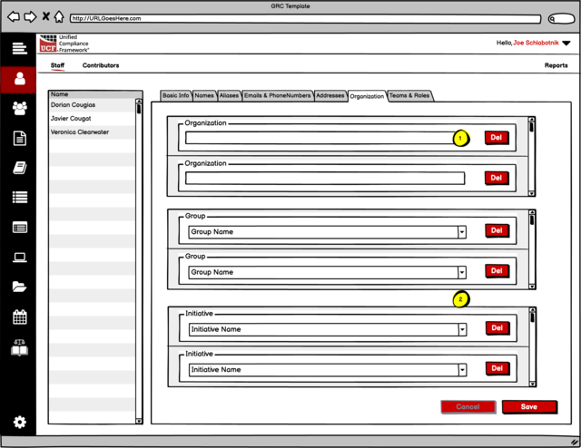
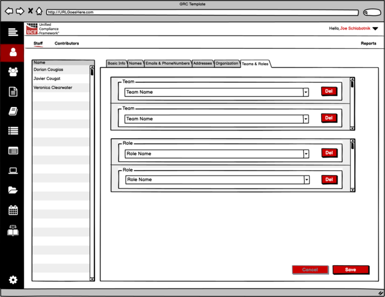
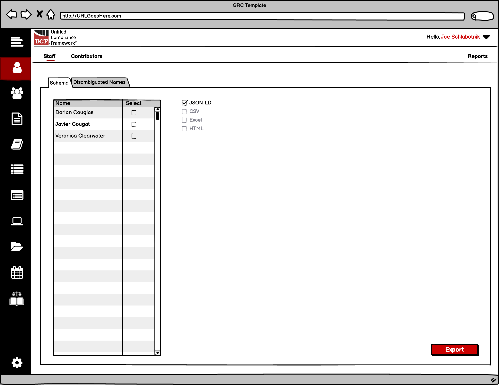

# Managing Staff

All wireframes for this portion of the Compliance as Code project are available at:

[https://balsamiq.cloud/srj76i4/p2y95mo](https://balsamiq.cloud/srj76i4/p2y95mo)

The scope of this portion of the project is to allow _the administrator_ of a known account to create and maintain users assigned to that account.

The layouts expressed in this documentation are for _communication purposes only_. They are not meant to provide branding guidance or even an official look-and-feel. They exist merely to convey the technical aspects of the project. _Real_ designers will create something much more effective.

## Schema

The schema for an account is found in multiple locations:

* [http://grcschema.org/Account](http://grcschema.org/Account), which provides the core schema for an account;
* [http://grcschema.org/Person](http://grcschema.org/Person), which provides the schema for a person’s name and email address \(becoming the User in the account array\); and
* [http://grcschema.org/Organization](http://grcschema.org/Organization), which provides the schema for the domain to organization match; and
* [http://grcschema.org/Users](http://grcschema.org/Users), which provides a simplified schema for connecting users to accounts.

The ERD for working with staff looks like the diagram that follows:

## Navigation

Main navigation for Staff is accessed by the Person icon \(1\) as shown in the following diagram.

Within the Person section of the shell, sub-navigation must include capabilities to switch between _Staff_, _Contributors_, and _Reports_ as shown in \(2\) within the following diagram.

## Basic Info

Basic information for each staff member comprises their primary name & email address \(mandatory\), and optional social addresses. The suggested layout for basic information follows:

1. Navigation must be available for all staff members. In this example we’ve doubled navigation with the ability to add new staff members \(by entering them into the last blank field\) or deleting them through the minus “-“ button.

2. Each person’s name has two mandatory fields: first name and last name. This sets the person’s primary name content in the Names layout.

2a. The Prefix for a person’s name is created from a pop-up selector. The results of the selection should show both the abbreviated prefix and the full prefix. \(see Name prefixes and suffixes below\)

2b. The Suffix for a person’s name is created from a pop-up selector. The results of the selection should show both the abbreviated suffix and the full suffix. \(see Name prefixes and suffixes below\)

3. It is **mandatory** that the domain for the staff member’s email address be derived from the domain of the organization. Therefore, this field can either be manually filled out \(but tested against the domain\) or it can be automatically filled out from the _disambiguated system name_ \(10\) plus the domain name.

4-6. Social media addresses are optional.

7. This is automated data and comes from the records. Having this in the Staff layout _is optional_.

8. This is automated. \(see Calculating the full name below\).

9 & 10. These are both automatically calculated. \(see Calculating disambiguated names below\).

11. These are optional checkboxes that denote whether the staff member is the **admin**, the **billing contact**, or a **contributor** to content added to the federated mapping system.

### Name prefixes and suffixes

For standardization purposes all name prefixes and suffixes are added via a predefined list, using the ID of the prefix and suffix to tie the text to the ID. The application _must_ maintain tables of these references and _must_ update those tables on a regular basis to ensure parity with the federated system.

* **Name Prefix** **schema** – [http://grcschema.org/NamePrefixes](http://grcschema.org/NamePrefixes)\*\*\*\*
* **Name Prefix API** – [https://short.grcschema.org/API-NamePrefix List](https://short.grcschema.org/API-NamePrefix%20List)\*\*\*\*
* **Name Suffix schema** – [http://grcschema.org/NameSuffixes](http://grcschema.org/NameSuffixes)\*\*\*\*
* **Name Suffix API** – [https://short.grcschema.org/API-NameSuffix List](https://short.grcschema.org/API-NameSuffix%20List)

### Calculating the full name

The full name is calculated as

`if(prefix≠null;prefix & “ “) & first name & “ “ & if(middle initial≠null;middle initial & “ “) & last name & if(suffix≠null;” “ & suffix)`

### Calculating disambiguated names

The larger the organization, the greater the chances that duplicate names might exist when combining first and last names. Two people named James and John Smith would create a duplicate if the organization’s naming standard were first initial followed by last name. Joseph L. Smith and Joe T Smith would create duplicates if the organization’s naming standard were first name followed by last name.

Therefore, two things must happen.

a. The organization should establish a standard name configuration system for creating system names. The basic system can be as simple as the “name configurator” shown below:

Sample name configurator

 This has settings for first, middle, last names, whether to uses spaces or periods between names, how to set the case, and even whether to convert the text to ASCII characters.

b. The name configuration standard _could_ produce duplicate results. Therefore, a methodology for disambiguation needs to be put into place. Whether this method is configurable \(such as the name configurator\) or automatic doesn’t matter. One algorithm is to simply add a numeric value behind the system name so that the second joseph.smith would become joseph.smith2, the third joseph.smith3, and so on. It can be more complicated than that, or as simple as that.

## Staff Names

Staff names is an array of names. The person’s _primary_ name can be set from here or on the Basic Info layout.

For all names, the First Name and the Last Name must be filled out.

There is a bit of a trick to this layout – a person’s name can either be in the format of a name or an alias. If an alias, the only thing filled out is the freeform\_name field, not shown here. Therefore, this layout should _not include_ any record wherein the freeform\_name is the only entry.

## Aliases

There is a bit of a trick to this layout, as mentioned in Staff Names above. This layout is _only_ for names records that _only_ have the freeform\_name field filled out.

1. This is the freeform name. The **Disambiguated System Name** is _always_ entered as a record for this user.

2. This is the _alias type ID_ and is derived from _something other than_ “1”, from the Primary field.

 2 = disambiguated system name

 3 = previous system name

## Emails and Phone Numbers

These are both arrays assigned to a staff member. Other than the primary email address, they are optional.

The _calling codes_ for phone numbers can be automatically created using the callingcodes schema and API calls.

**Calling Codes Schema** - http://grcschema.org/CallingCode

**Calling Codes API** – not finished yet

## Postal Addresses

Postal Addresses for each staff member are optional. When filled out, they must be filled out in the order of _country_, _state_, _city_, and then the rest of the information. This is because _country_, _state_, and _city_ are all pop-ups, one deriving its list from the other.

1. **Country** **API** – [https://short.grcschema.org/API-Country List](https://short.grcschema.org/API-Country%20List)

2. **State API** -

[https://short.grcschema.org/API-State List](https://short.grcschema.org/API-State%20List3)

[3](https://short.grcschema.org/API-State%20List3). **City API** - [https://short.grcschema.org/API-City List](https://short.grcschema.org/API-City%20List)

## Organization

The default Organization \(associated through the staff member’s domain\) will always be listed and should not be able to be removed.

1. Organization - This probably shouldn’t even be a list.

2. Groups and Initiatives should be pop-ups selectable from _existing_ groups and initiatives _found in this account or Organization_.

## Teams and Roles

These are completely optional for being filled out. Both teams and roles should be pop-ups selectable from _existing_ teams and roles _found in this account or Organization_.

## Reports

The reports window should contain a list of reports, and a method to select the individuals within the organization to add/subtract from the list.

Reports

As such, there are two reports that should be added to the list of reports at this point

**Schema** – this exports a JSON-LD of all of the selected members in the Person schema.

**Disambiguated Names** – A four-column list comprising the person’s ID, full name, email address, and disambiguated name.

The file formats, for now, are

**JSON-LD** – which should _always_ be a selectable choice

**CSV** – which should _only_ be selectable if the output does not contain embedded arrays

**Excel** – which should _only_ be selectable if the output does not contain embedded arrays

**HTML** – which is only a choice in very specific reports \(none of which are used at this time\).

