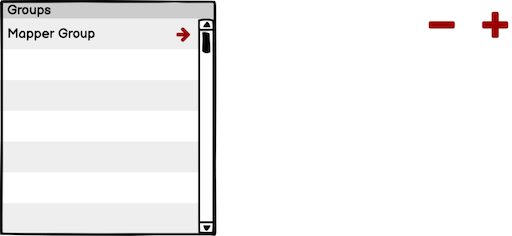
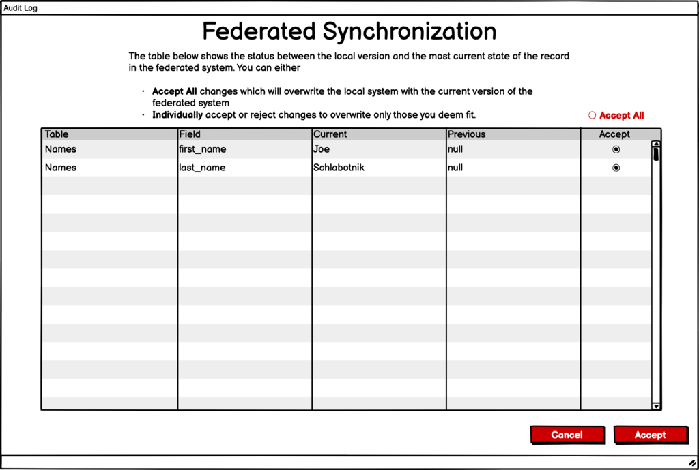

# Standardized Elements

The public sharing for these wireframes is:

[https://balsamiq.cloud/srj76i4/p3l8wr](https://balsamiq.cloud/srj76i4/p3l8wr)

While these are designed here in Balsamiq, we highly suggest that the components be translated into Material-UI React components, found here: [https://react-material-kit.devias.io/browse](https://react-material-kit.devias.io/browse).

The items presented here are used and re-used throughout the system, and therefore, are presented as such.

## Standardized Jump to & add/delete buttons

A small, colorized right-facing arrow \(\) indicates a hyperlink to the related record it is on. Large, colorized minus \(-\) and plus \(+\) signs appearing next to each other indicate that the record in question can be deleted \(minus, -\) or a new record can be added \(plus, +\).

## Standardized deletion message

When a record is being deleted, prior to deletion a standardized dialog will appear double-checking with the end user to determine if the record should _really_ be deleted.

## Standardized Required Field error message

Any time a record is being created or modified, the system must check for required fields to be filled out \(and sometimes filled out correctly\). When a required field is _not_ filled out, or done so correctly, a standardized message emanating from the **Save**, **Continue**, or other button will appear listing the fields to be reviewed.

Along with that, the field\(s\) in question will be highlighted in red to give the end users another visual presentation of which field\(s\) need to be reviewed.

## Standardized Addition of Records to an Array

There are many ways to add a standardized method of handling new records in an array. One of them is proposed below. This method is to show an additional record below the record set \(or above it\) with appropriate text prompts to show the user that this is where they enter new records for the array. For these records, the delete button is grayed out as an additional visual indication of this being a placeholder for new records.

Once the user has entered information into the new record in the array, and clicked Save, the delete button becomes an active button and a new blank in the array is presented.

## Change synchronization

ChangeHistory is a key element in managing federated information. In short, the two main objects within ChangeHistory are current\_object and previous\_object which store exactly what they say – a snapshot of the current state of the record and the previous state of the record.

In order to accept the changes between the federated system and the local system, the end user must be presented with a method by which to do so. The easiest way is to display a listing of all of the changed fields within the given record and allow the user to either accept all of them or to accept individual changes.

