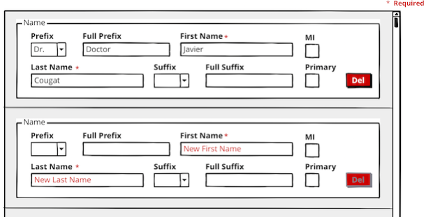

# The Shell application

The federated mapping application we describe utilizes a multi-tenant architecture. The shell that we’ve designed, is designed to fit within the confines of a laptop or an iPad Pro. As such, the _suggested_ window proportions are 1368 wide x 996 high. Below are basics for the window’s shell:

1. The top left of the window is for branding and logos.

2. If the window will be a sign-in window, this is where the active User’s name will go. The dropdown will show

* the user’s name,
* a button to go to the user’s profile, and
* a button to sign the user out.

3. This is the area for the main vertical menu, if there is to be one. When the top icon is clicked it will expand to show the names of the vertical icons. When closed, it is 85 px wide. This is 80 px wide.

4. If there is pagination, the current page is shown on the bottom left.

5. If there is pagination, the navigation for the pagination is shown on the bottom right.

## Brand Colors

Each client should have the capability of adding their logo and both primary and secondary colors, as shown below.

1.  The clients should be able to upload their logo.
2. The clients shuld be able to have a primary brand color used for highlighting, fonts, headlines, etc.
3. A secondary color should also be choosable for the title bar.

## Basic Navigation

Basic navigation in our demonstration file follows the same format we’ve designed for many of our websites, such as the [CommonControlsHub.com](https://cch.commoncontrolshub.com/) website.

1. Left vertical navigation has the following items which _must_ be a part of any federated mapping application:

* Personnel
* Orgs & Activities
* Authority Documents
* Dictionary
* Citations
* Common Controls
* Assets
* Records
* Events
* Corpora Management 
* cog at the bottom is settings

2. Subnavigation is found in-between the top two horizontal rules. Selected navigation will have a red underscore below it.

### Expanded Basic Navigation

As with our other applications, the left-hand navigation opens and closes for readability and sub-contents.

1. All names of primary menu items will be in bold. The fonts will be sized no less than 14 points for readability. When expanded, the vertical menu will show disclosure triangles for those items that have sub-menus. Sub-menu items will be indented and not in bold but at the same font size. The selected items will always be in the product’s primary highlight color.

